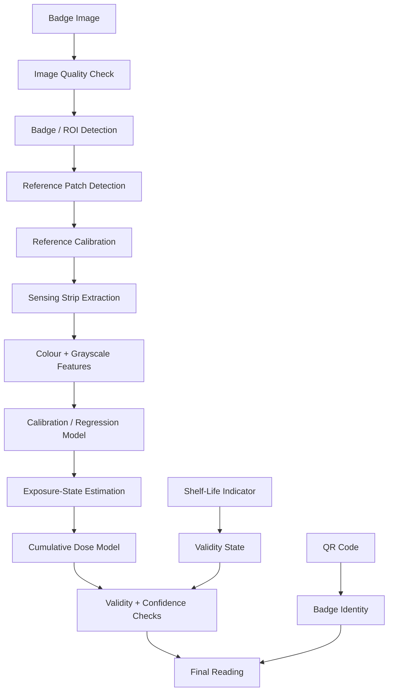

# Cumulative H₂S Colorimetric Dosimeter

> **A passive, low-cost approach to estimating cumulative hydrogen sulfide exposure through colorimetric change and smartphone-based analysis.**

[](#current-status)
[](#software-direction)
[](#concept)

---

## Overview

This project explores a **passive wearable dosimeter for cumulative H₂S exposure**.

The core idea is deliberately simple:

> **Exposure changes the sensing strip → the strip retains that change → a smartphone reads the change → software estimates the accumulated exposure.**

The physical badge is being designed around four visual elements:

1. **Primary sensing strip** — progressively changes with accumulated exposure.
2. **Reference / detection palette** — fixed reference patches captured in the same image as the sensing strip.
3. **Independent shelf-life indicator** — a separate visual indicator used to identify whether the badge is still within its usable period.
4. **QR code** — provides a digital identity for the badge and can be used to associate a reading with a worker, batch, calibration version, or manufacturing information.

The project is being developed as a **research prototype**, not as a replacement for certified industrial gas alarms or occupational safety systems.

---

## Why cumulative exposure?

A conventional gas detector answers a question such as:

> **What is the gas concentration right now?**

Our prototype is interested in a different quantity:

> **How much exposure has accumulated over time?**

The conceptual measurement is:

\[
D = \int C(t)\,dt
\]

where:

- `D` = cumulative exposure
- `C(t)` = H₂S concentration as a function of time
- `t` = exposure duration

For a discrete measurement:

\[
D \approx \sum C_i\Delta t
\]

The eventual output is intended to be expressed in **ppm·h**, subject to experimental calibration.

A color strip cannot simply be assumed to be a perfect linear dose meter. Reaction rate, saturation, temperature, humidity, substrate behaviour, storage history, illumination, and camera response can all affect the observed colour.

That is why the project is being developed as a **calibrated measurement system**, rather than as a simple colour chart.

---

# 1. Project Concept

```text
                 PASSIVE BADGE
                      │
        ┌─────────────┼─────────────┐
        │             │             │
        ▼             ▼             ▼
   Sensing Strip   Reference     Shelf-Life
                    Palette       Indicator
        │             │             │
        └─────────────┼─────────────┘
                      │
                      ▼
               Smartphone Image
                      │
                      ▼
              Image Quality Check
                      │
                      ▼
             ROI / Patch Detection
                      │
                      ▼
             Reference Calibration
                      │
                      ▼
          Colour + Grayscale Features
                      │
                      ▼
             Dose/State Estimation
                      │
                      ▼
          Confidence + Validity Checks
                      │
                      ▼
             Digital Exposure Record
```

The intended system is therefore a combination of:

**passive sensing + reference-based colorimetry + computer vision + calibration + exposure modelling.**

---

# 2. How the Physical Strip Is Intended to Work

The badge is not intended to provide only a binary result such as:

```text
EXPOSED / NOT EXPOSED
```

Instead, development is focused on a **progressive response**:

```text
Initial State
     ↓
Low Reaction
     ↓
Intermediate Reaction
     ↓
Higher Reaction
     ↓
Near Saturation
```

The exact colour progression and dose relationship will be established experimentally.

### Important distinction

The colour seen by a human is **not itself the measurement**.

The measurement pipeline will attempt to convert:

```text
Physical exposure
      ↓
Chemical / material state
      ↓
Optical colour change
      ↓
Image features
      ↓
Calibrated model
      ↓
Estimated cumulative exposure
```

This distinction is important because the same physical strip can appear different under different lighting and camera conditions.

---

# 3. Development Journey

This project did not begin with a finished sensing formulation.

The first stage was exploratory. We started by investigating a **cascade-based sensing approach**, with an initial formulation selected as a practical starting point for laboratory experimentation.

Early testing was useful even when the response was not sufficient.

Instead of treating the first formulation as the final solution, the development process became iterative:

```text
Initial formulation
        ↓
First experimental observations
        ↓
Identify response limitations
        ↓
Study alternative sensing behaviour
        ↓
Compare response and stability
        ↓
Refine strip architecture
        ↓
Build a more controlled calibration strategy
```

This iteration is an important part of the project.

The objective is not to claim that the first approach was perfect. The objective is to understand **why a formulation behaves the way it does**, what controls the visible response, and what needs to change before a reliable prototype can be produced.

### What we learned during the early stage

The experiments pushed the project toward several practical conclusions:

- A visible colour change is not enough; the change must be **repeatable**.
- The response needs to be studied against **exposure × time**, not only concentration.
- A reference palette is necessary because smartphone RGB values are affected by illumination and camera processing.
- A physical strip needs a defined **usable range and saturation region**.
- Shelf life must be treated separately from exposure response.
- Image analysis should not depend on a single RGB channel without experimental validation.
- A model should be trained only after a sufficiently controlled experimental dataset exists.

The current work therefore separates **chemical/material development** from **digital measurement development**, while allowing both to converge through calibration.

---

# 4. Physical Badge Architecture

The current conceptual layout is:

```text
┌─────────────────────────────────────────────┐
│                                             │
│   PRIMARY SENSING STRIP                     │
│   ┌───────────────────────────────┐         │
│   │                               │         │
│   │       EXPOSURE RESPONSE       │         │
│   │                               │         │
│   └───────────────────────────────┘         │
│                                             │
│   REFERENCE / DETECTION PALETTE             │
│   ┌─────┬─────┬─────┬─────┬─────┐           │
│   │ REF │ REF │ REF │ REF │ REF │           │
│   └─────┴─────┴─────┴─────┴─────┘           │
│                                             │
│   SHELF-LIFE INDICATOR      QR              │
│   ┌──────────────────┐     ┌───────┐        │
│   │  VALID → EXPIRED │     │  QR   │        │
│   └──────────────────┘     └───────┘        │
│                                             │
└─────────────────────────────────────────────┘
```

The final physical geometry may change after fabrication and imaging tests.

---

# 5. Reference Palette

The reference palette is one of the most important parts of the design.

A smartphone does not measure colour independently of its surroundings. Illumination, exposure, white balance, lens characteristics, image processing, and camera-to-badge geometry can all change the recorded pixel values.

Published work on smartphone colorimetry and paper-based analytical devices similarly identifies lighting and device variability as important sources of measurement variation.

Therefore, the badge will contain **known visual reference patches beside the sensing region**.

```text
Known Reference
      +
Observed Reference
      ↓
Estimate Image Transformation
      ↓
Correct Sensing Region
      ↓
Analyse Corrected Signal
```

The reference patches are captured in the **same image** as the sensing strip. This gives the software information about the imaging conditions at the time of measurement.

---

# 6. Color Analysis Strategy

We will not assume that raw RGB alone is sufficient.

The software direction is to compare several representations:

```text
Captured Image
      │
      ├── RGB
      ├── Normalized RGB
      ├── HSV
      ├── CIELAB
      ├── Grayscale
      └── Reference-relative features
```

### Grayscale

Grayscale will be explicitly evaluated because it provides a useful representation of **overall optical darkness / intensity**.

However:

> **Grayscale will not be treated as a replacement for colour information.**

Converting an image to grayscale removes hue information. Therefore, the practical approach is to evaluate grayscale as an **additional feature** alongside colour-space features.

For example:

```text
RGB + Lab + Grayscale
        ↓
Feature comparison
        ↓
Calibration model
        ↓
Experimental validation
```

If the sensing response turns out to be dominated by darkness rather than hue, grayscale may become a particularly useful feature. If hue carries additional information, Lab/normalized RGB features can preserve it.

The data will determine the final feature set.

---

# 7. Proposed Software Pipeline

The software is being designed as a measurement pipeline rather than a simple colour-picker.



---

# 8. Image Processing

The first stage of image processing will focus on making the measurement reproducible.

### Planned checks

- Detect whether the badge is present.
- Locate the sensing strip.
- Locate reference patches.
- Reject severely blurred images.
- Detect overexposure / underexposure.
- Check whether the badge is sufficiently aligned.
- Estimate whether the sensing region is partially occluded.
- Reject images where reference patches cannot be reliably detected.

Conceptually:

```text
Image
  ↓
Quality Gate
  ├── Too blurred?       → Reject
  ├── Too dark/bright?   → Reject
  ├── Badge missing?     → Reject
  ├── Reference missing? → Reject
  └── Otherwise         → Continue
```

This prevents the model from producing a numerical answer from an image that should never have been analysed.

---

# 9. Reference-Based Calibration

For each reference patch, the system will have:

```text
Expected reference value
        vs.
Observed reference value
```

From multiple reference patches, the software can estimate a transformation between the photographed image and the calibrated colour space.

A simple first model can be represented as:

\[
Y \approx AX + b
\]

where:

- `X` = observed image features
- `Y` = reference target values
- `A` = learned transformation matrix
- `b` = offset

The final implementation will be selected experimentally.

Possible approaches include:

- per-channel normalization
- affine colour correction
- least-squares calibration
- polynomial calibration
- Lab-space correction
- reference-relative feature ratios

The project will prefer the **simplest model that provides sufficient experimental accuracy**.

---

# 10. Dose Estimation

The physical strip is expected to have a nonlinear response.

A conceptual saturation model is:

\[
f(D)=1-e^{-kD}
\]

where:

- `f(D)` = normalized reaction state
- `D` = cumulative exposure
- `k` = effective response parameter

This equation is currently a **modelling assumption**, not an experimentally validated law for the final strip.

The physical experiments will determine whether a model of this type is appropriate.

Other models may be tested if the experimental response suggests:

- linear behaviour over a limited range
- logarithmic behaviour
- polynomial calibration
- logistic/sigmoidal behaviour
- piecewise calibration
- empirical lookup-table interpolation

The final model should be selected from measured data rather than chosen because it looks mathematically convenient.

---

# 11. Machine Learning Direction

Machine learning will be introduced only where it provides a measurable advantage.

The proposed progression is:

```text
Experimental Dataset
        ↓
Feature Extraction
        ↓
Simple Calibration Baseline
        ↓
Cross-Validation
        ↓
Compare More Advanced Models
        ↓
Select Model Based on Validation
```

### Candidate features

```text
Normalized R
Normalized G
Normalized B
HSV features
Lab features
Grayscale intensity
Reference-relative values
Colour distance to calibration states
Spatial statistics within ROI
```

### Candidate models

The first baseline should be simple:

- linear regression
- polynomial regression
- ridge regression
- partial least squares regression

If the dataset becomes sufficiently large and nonlinear behaviour is observed, lightweight tree-based models can be evaluated.

The important principle is:

> **Do not use a neural network just because it is called AI.**

For a small laboratory dataset, a well-calibrated regression model can be more appropriate, easier to validate, easier to explain, and easier to deploy.

---

# 12. Experimental Dataset

The digital model will eventually be trained from physical measurements.

Each experimental sample should ideally contain:

```text
Known exposure condition
+
Exposure duration
+
Temperature
+
Relative humidity
+
Strip image
+
Reference-palette image
+
Measured colour features
+
Observed reaction state
```

A conceptual dataset could therefore look like:

| Exposure | Duration | Temperature | RH | R | G | B | Lab | Gray | State |
|---|---:|---:|---:|---:|---:|---:|---|---:|---|
| Controlled | t₁ | T₁ | RH₁ | ... | ... | ... | ... | ... | ... |
| Controlled | t₂ | T₂ | RH₂ | ... | ... | ... | ... | ... | ... |
| Controlled | t₃ | T₃ | RH₃ | ... | ... | ... | ... | ... | ... |

The actual calibration dataset will be generated during controlled laboratory testing.

No fabricated accuracy values are included in this repository.

---

# Environmental Dataset

Temperature and humidity will be recorded as part of the experimental dataset.

```text
sample_id
concentration_ppm
duration_h
dose_ppm_h
temperature_c
humidity_pct
hue
saturation
value
gray_mean
exposure_state
```

The ground-truth dose is calculated from the measured exposure history:

\[
D_{true}=\sum_i C_i\Delta t_i
\]

Example structure:

| Sample | Concentration | Duration | Dose | Temp | RH | Hue | Sat. | Value | State |
|---|---:|---:|---:|---:|---:|---:|---:|---:|---|
| S001 | 1.0 | 1.0 | 1.0 | 25 | 55 | ... | ... | ... | Very Low |
| S002 | 2.0 | 1.0 | 2.0 | 25 | 55 | ... | ... | ... | Low |
| S003 | 5.0 | 1.0 | 5.0 | 25 | 55 | ... | ... | ... | Moderate |

The numerical rows are examples of structure only, not experimental results.

---

# 13. Experimental Design Direction

The physical experiments will focus on separating the variables that can affect the strip response.

### Primary variables

```text
Exposure level
Exposure duration
Temperature
Relative humidity
Storage time
```

### Imaging variables

```text
Phone model
Distance
Viewing angle
Illumination
Exposure
Focus
Image format
```

The experimental programme will attempt to determine:

1. Whether the response is repeatable.
2. Whether the colour change is monotonic over the intended range.
3. Where saturation begins.
4. How much temperature changes the response.
5. How much humidity changes the response.
6. How storage affects the baseline.
7. Whether the same calibration works across multiple phones.
8. Whether reference-based correction reduces imaging variability.

---

# 14. Prototype Target

The initial prototype development is focused on a **low-concentration working range around 0–20 ppm**, with the exact useful range to be determined experimentally.

This is a **development target**, not an occupational exposure recommendation or safety threshold.

The prototype should eventually answer:

```text
Given:
    a calibrated badge
    + a known imaging protocol
    + an experimental calibration model

Can we estimate:
    cumulative H₂S exposure
    with a measurable and reproducible error?
```

That question will be answered through physical validation rather than assumed from simulation.

---

# 15. H₂S Context

H₂S is a colourless, flammable gas with a characteristic odour at low concentrations, but **smell must not be used as an exposure indicator** because olfactory fatigue can occur.

According to the NIOSH Pocket Guide, H₂S has:

- molecular weight: approximately **34.1**
- relative gas density: approximately **1.19**
- boiling point: approximately **−77°F**
- lower explosive limit: approximately **4%**
- NIOSH REL: **10 ppm ceiling over 10 minutes**

These values are included only as engineering context. The prototype is not intended to replace certified industrial monitoring equipment.

Source: NIOSH Pocket Guide to Chemical Hazards.

---

# Data Leakage

For image-based experimental data, multiple photographs of the same physical strip must not be randomly split across training and testing.

The split should be performed by **physical sample / experiment**:

```text
Physical samples
      ↓
Group by strip / experiment
      ↓
Train
Validation
Test
```

This prevents the model from appearing accurate simply because it has seen another photograph of the same physical sample during training.

---

# 16. Shelf-Life / Expiry Indicator

The badge will contain a **separate visual indicator for shelf life**.

This indicator is deliberately separated from the exposure sensing region.

Concept:

```text
Fresh Badge
     ↓
Indicator State A
     ↓
Storage / Ageing
     ↓
Indicator Transition
     ↓
Indicator State B
     ↓
Badge validity decision
```

The indicator is intended to answer:

```text
Is this badge still valid for measurement?
```

It should not be used as the exposure measurement itself.

### Development target

The current design direction considers shelf-life targets such as:

```text
30 days
90 days
```

The actual shelf life will depend on experimental ageing studies.

Future testing should examine:

- temperature
- humidity
- packaging
- light exposure
- storage duration
- baseline drift
- false transitions
- batch-to-batch variation

---

# 17. QR Code and Digital Identity

The QR code is intended to connect the physical badge to its digital record.

Possible information associated with a badge:

```text
Badge ID
Batch ID
Calibration version
Manufacturing date
Shelf-life configuration
Model version
```

The QR code itself does **not** measure H₂S.

It provides identity and traceability.

This allows a future workflow such as:

```text
Scan QR
   ↓
Identify Badge
   ↓
Load Correct Calibration
   ↓
Capture Image
   ↓
Analyse Strip
   ↓
Store Result
```

---

# 18. Smartphone Application Direction

The future application is intended to make measurement controlled rather than dependent on the user manually selecting colours.

### Proposed reading flow

```text
Worker Setup
     ↓
Badge / QR Identification
     ↓
Camera
     ↓
Automatic Badge Alignment
     ↓
Image Quality Check
     ↓
Automatic Capture
     ↓
Reference Calibration
     ↓
Strip Analysis
     ↓
Exposure Estimation
     ↓
Validity Check
     ↓
Result
     ↓
Historical Record
```

Potential result information:

```text
Estimated cumulative exposure
Measurement validity
Badge validity
Timestamp
Worker / badge ID
Calibration version
Model confidence
```

---

# 19. Why the Reference Palette Matters

A raw RGB value is not a universal measurement.

For example, the same physical patch photographed under:

```text
Cool daylight
        vs.
Warm indoor light
```

can produce substantially different camera values.

Similarly:

```text
Phone A
        vs.
Phone B
```

may apply different image-processing pipelines.

This is why the project treats the reference palette as part of the **measurement architecture**, not as decoration.

The reference palette allows the system to estimate how the imaging conditions affected the photograph.

---

# 20. Computer Vision Direction

The computer vision layer will focus on a small number of measurable tasks.

### 20.1 Badge detection

Detect the expected badge region using:

- contour geometry
- colour/reference patterns
- edge structure
- perspective correction

### 20.2 Reference detection

Locate the known reference patches.

### 20.3 Sensing ROI

Extract the sensing strip while avoiding:

- borders
- printed markings
- shadows
- glare
- damaged regions

### 20.4 Image quality

Evaluate:

- blur
- brightness
- contrast
- clipping
- alignment
- reference visibility

### 20.5 Feature extraction

Calculate features from the sensing ROI:

```text
Mean
Median
Standard deviation
Percentiles
RGB
Normalized RGB
HSV
Lab
Grayscale
Colour distance
Reference-relative features
```

Spatial statistics can also be evaluated because the strip may not change uniformly.

---

# 21. Grayscale as an Additional Signal

One of the directions being evaluated is whether the response can be represented reliably using grayscale.

```text
Original Image
      ↓
 ┌────┴────┐
 ▼         ▼
Colour   Grayscale
Features  Intensity
 └────┬────┘
      ▼
 Combined Model
```

Grayscale has an advantage: it is less dependent on hue representation.

But it also removes colour information.

Therefore, the project will experimentally compare:

```text
RGB only
Lab only
Grayscale only
RGB + Grayscale
Lab + Grayscale
RGB + Lab + Grayscale
```

The final choice will be based on validation error, robustness, and computational simplicity.

---

# 22. Model Validation

A model should not be considered successful simply because it fits the data used to train it.

The planned evaluation is:

```text
Physical Dataset
       ↓
Train / Validation Split
       ↓
Cross-Validation
       ↓
Model Selection
       ↓
Independent Test Samples
       ↓
Error Analysis
```

Metrics can include:

- MAE
- RMSE
- median absolute error
- relative error
- calibration residual
- repeatability
- confidence interval coverage
- performance across lighting conditions
- performance across phones
- performance across temperature/humidity conditions

The exact acceptance thresholds will be defined after the first physical dataset is collected.

---

# 23. Current Software Direction

The computational prototype can be structured into small modules:

```text
src/
├── environment.py
├── reaction_model.py
├── color_features.py
├── calibration.py
├── image_quality.py
├── dose_estimator.py
├── validation.py
└── main.py
```

### Module responsibilities

| Module | Purpose |
|---|---|
| `environment.py` | Exposure, temperature and humidity conditions |
| `reaction_model.py` | Candidate response models |
| `color_features.py` | RGB, Lab, HSV and grayscale extraction |
| `calibration.py` | Reference-palette calibration |
| `image_quality.py` | Blur, brightness and capture validation |
| `dose_estimator.py` | Convert calibrated features to exposure estimate |
| `validation.py` | Cross-validation and error analysis |
| `main.py` | End-to-end experiment |

The final structure may change as the physical prototype develops.

---

# 24. Development Roadmap


### Phase 1 — Material / Strip Development

- Establish a repeatable sensing response.
- Compare candidate formulations.
- Identify useful response range.
- Study saturation and baseline drift.

### Phase 2 — Controlled Exposure

- Test controlled exposure levels and durations.
- Record temperature and humidity.
- Photograph the strip consistently.
- Build the first physical dataset.

### Phase 3 — Digital Calibration

- Detect reference patches.
- Correct image variation.
- Compare RGB, Lab and grayscale features.
- Establish an experimental calibration curve.

### Phase 4 — Model Development

- Establish a simple statistical baseline.
- Compare candidate regressors.
- Use cross-validation.
- Test on unseen experimental samples.

### Phase 5 — Smartphone Prototype

- Automatic badge detection.
- Automatic image quality assessment.
- Reference calibration.
- Strip analysis.
- Dose estimation.
- QR-based badge identification.

### Phase 6 — Integrated Validation

- Repeatability testing.
- Phone-to-phone testing.
- Temperature/humidity testing.
- Storage testing.
- Shelf-life testing.
- Controlled laboratory validation.

### Phase 7 — Field Evaluation

Only after laboratory validation should the integrated prototype be evaluated under representative occupational conditions.

---

# 25. Current Status

### Concept and research

- [x] Cumulative exposure concept defined
- [x] Passive wearable architecture explored
- [x] Progressive colour response concept defined
- [x] Reference palette concept defined
- [x] Independent shelf-life indicator concept defined
- [x] QR-based badge identity concept defined
- [x] Smartphone colour analysis investigated
- [x] Initial formulation experiments started
- [x] Alternative sensing approaches being evaluated

### Software / analysis

- [x] Cumulative exposure model defined
- [x] Image-based colour analysis direction defined
- [x] Reference-based calibration direction defined
- [x] Grayscale analysis included as an experimental feature
- [ ] Physical calibration dataset
- [ ] Final colour-response model
- [ ] Validated dose estimator
- [ ] Cross-device validation
- [ ] Uncertainty model based on physical data

### Physical prototype

- [ ] Final sensing strip
- [ ] Final badge geometry
- [ ] Reference palette fabrication
- [ ] Shelf-life indicator validation
- [ ] Controlled exposure dataset
- [ ] Integrated smartphone reader
- [ ] Laboratory validation

---

# 26. What This Repository Will Not Claim

This repository deliberately avoids presenting simulation or early laboratory observations as final performance.

We will not claim:

- a validated ppm·h accuracy before physical calibration
- a universal colour-to-dose relationship
- phone-independent accuracy without testing
- a fixed shelf life without ageing studies
- safety certification
- replacement of certified H₂S alarms
- field reliability before controlled validation

The goal is to keep the engineering claims proportional to the evidence.

---

# 27. Research Basis

The development direction is informed by work in three areas:

### H₂S exposure and physical properties

NIOSH documentation provides occupational exposure context and physical-property information for H₂S.

- NIOSH Pocket Guide to Chemical Hazards — Hydrogen Sulfide
- NIOSH occupational exposure documentation

### Smartphone colorimetry

Published analytical work shows that smartphone cameras can be used to extract quantitative colour information, but also highlights the influence of lighting, camera processing, phone-to-phone variation and measurement conditions.

### Paper-based colorimetric analysis

Research on paper-based analytical devices provides a useful basis for understanding image acquisition, colour quantification, calibration and environmental variability.

Selected references:

1. **Quantification of Colorimetric Data for Paper-Based Analytical Devices**, *ACS Sensors*.
2. **Scaling the Analytical Information Given by Several Types of Colorimetric and Spectroscopic Instruments Including Smartphones**, *Analytical Chemistry*.
3. **Accessory-free quantitative smartphone imaging of colorimetric paper-based assays**, *Lab on a Chip*.
4. **Single-Image-Referenced Colorimetric Water Quality Detection Using a Smartphone**, *ACS Omega*.
5. **A sensitive colorimetric hydrogen sulfide detection approach based on copper-metal–organic frameworks and a smartphone**, *Analytical Methods*.

These references support the **measurement and imaging methodology**; they do not validate the specific sensing strip developed in this project.

---

# 28. Safety

H₂S is hazardous and flammable.

All physical exposure experiments must be conducted using appropriate laboratory controls, approved procedures, ventilation, gas monitoring, PPE, and supervision.

The project should never rely on:

```text
Smell
Human colour judgement
Prototype badge
Smartphone reading
```

as a substitute for certified safety monitoring.

The prototype is a research and engineering development platform.

---

# 29. Long-Term Vision

The long-term goal is not simply to make a strip that changes colour.

It is to build a complete measurement chain:

```text
                REAL-WORLD EXPOSURE
                        │
                        ▼
                 PASSIVE STRIP
                        │
                        ▼
                 OPTICAL CHANGE
                        │
                        ▼
                 SMARTPHONE IMAGE
                        │
                        ▼
              REFERENCE CALIBRATION
                        │
                        ▼
             COMPUTER VISION FEATURES
                        │
                        ▼
                CALIBRATED MODEL
                        │
                        ▼
             CUMULATIVE EXPOSURE
                        │
                        ▼
             VALIDITY + CONFIDENCE
                        │
                        ▼
                 DIGITAL RECORD
```

The engineering challenge is to make every transition in that chain measurable and experimentally defensible.

---

## Repository Status

**Research prototype — active development**

The physical sensing chemistry, calibration model, image-processing pipeline and final wearable architecture are still being experimentally refined.

The repository will evolve alongside the laboratory results.

---

## License

Add the project license here once the team has agreed on the intended licensing model.

---

## Acknowledgement

Developed as a student research and engineering project focused on passive cumulative H₂S exposure monitoring, colorimetric sensing, computer vision and smartphone-based measurement.


---

# Industrial Relevance

Potential application environments include:

- oil and gas operations
- refineries
- petrochemical facilities
- wastewater and sewage environments
- industrial maintenance
- confined-space work
- process plants
- selected chemical and industrial operations

The proposed value is not simply replacing a real-time detector.

```text
Certified / electronic monitor
        ↓
Current concentration / alarm condition

Passive cumulative dosimeter
        ↓
Accumulated exposure history
        ↓
ppm·h estimate
```

After appropriate laboratory validation, the two approaches could be complementary: real-time monitoring for immediate hazards and the passive system for cumulative exposure history.

The prototype remains a research system and is not a substitute for certified safety equipment.
